<!-- Animated Header -->
<h1 align="center">
  Hi 👋, I'm Kashyap Patel
</h1>

<h3 align="center">
  🚀 Mid-Level Full Stack Developer | MERN Stack | NestJS
</h3>

  

  

---

## 👨‍💻 About Me

🚀 **Mid-Level Full Stack Developer** with solid experience in **MERN Stack & NestJS**  
🧠 Focused on **clean architecture, scalability, and performance**  
🔐 Strong background in **authentication, REST APIs, and backend systems**  
📈 Writes **production-ready, maintainable, and scalable code**  
🤝 Open to **full-time roles, freelance work, and impactful projects**

---

## 🧠 Tech Stack

  

### 🌐 Frontend (MERN)

---

### 🧠 Backend

---

### 🗄️ Database

---

### ⚙️ DevOps & Tools

---

## 🧩 What I Build

✔ Full-stack MERN web applications  
✔ Scalable NestJS backend systems  
✔ Secure authentication & authorization  
✔ Clean, modular, testable APIs  
✔ Performance-focused architectures

---

## 📊 GitHub Stats & Activity

<!-- Contribution Table -->

  <!--  -->
  

<!-- Contribution Graph -->

  

---

## 🌐 Let’s Connect

  
  
  
  

---
